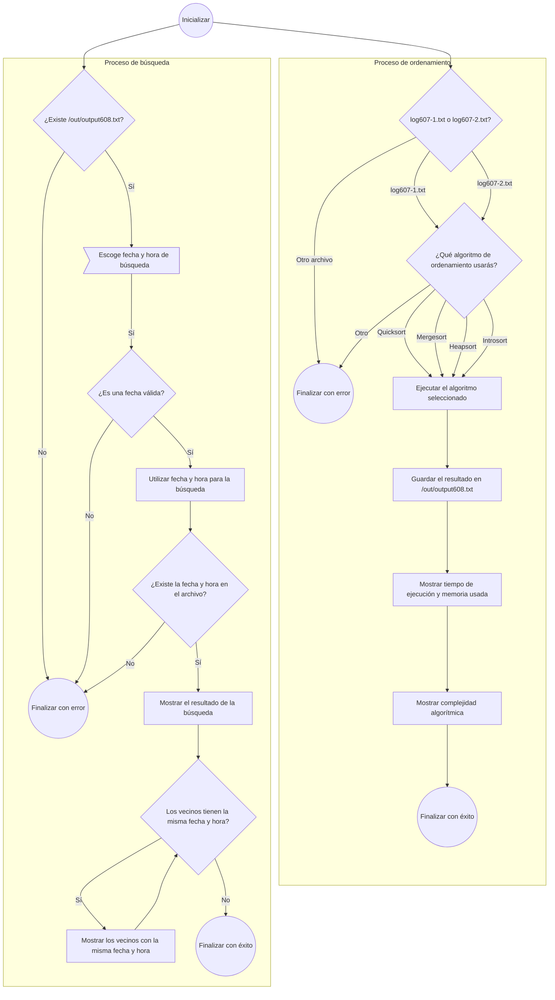

```mermaid
graph TD
    A((Inicializar)) 

    subgraph Proceso [Proceso de ordenamiento]
        direction TD
        B1{log607-1.txt o log607-2.txt?}
        B1 -->|log607-1.txt| C1{¿Qué algoritmo de ordenamiento usarás?}
        B1 -->|log607-2.txt| C1
        B1 -->|Otro archivo| Z1
        C1 -->|Quicksort| D1[Ejecutar el algoritmo seleccionado]
        C1 -->|Mergesort| D1
        C1 -->|Heapsort| D1
        C1 -->|Introsort| D1
        C1 -->|Otro| Z1
        D1 --> E1[Guardar el resultado en /out/output608.txt]
        E1 --> F1[Mostrar tiempo de ejecución y memoria usada]
        F1 --> G1[Mostrar complejidad algorítmica]

        G1 --> H1((Finalizar con éxito))

        Z1((Finalizar con error))
    end

    subgraph Proceso2 [Proceso de búsqueda]
        direction TD
        B2{¿Existe /out/output608.txt?}
        B2 -->|Sí| C2[Escoge fecha y hora de búsqueda]
        B2 -->|No| Z2
        C2>Escoge fecha y hora de búsqueda]
        C2 -->|Sí| D2{¿Es una fecha válida?}
        D2 -->|Sí| E2[Utilizar fecha y hora para la búsqueda]
        D2 -->|No| Z2
        E2 --> F2{¿Existe la fecha y hora en el archivo?}
        F2 -->|Sí| G2[Mostrar el resultado de la búsqueda]
        G2 --> H2{Los vecinos tienen la misma fecha y hora?}
        H2 -->|Sí| I2[Mostrar los vecinos con la misma fecha y hora]
        I2 --> H2
        H2 -->|No| C
        F2 -->|No| Z2


        Z2((Finalizar con error))
    end


    A --> B1
    A --> B2
    C((Finalizar con éxito))
```

